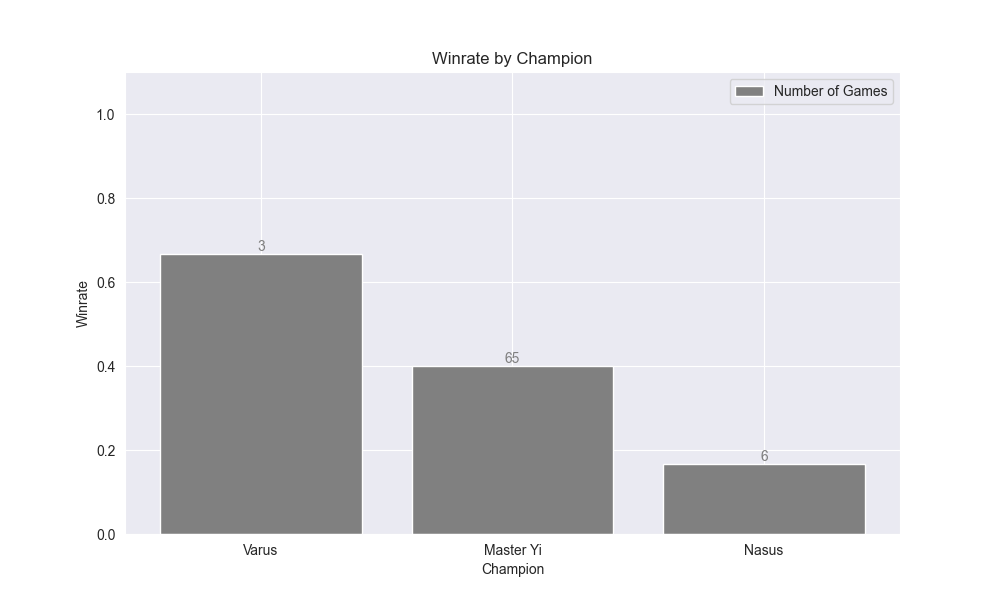
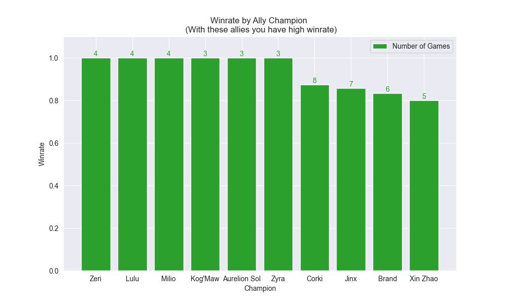
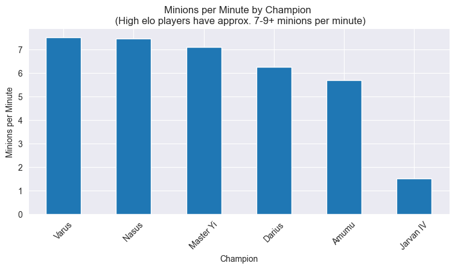

# League of Legends Player Stats Jupyter Notebook
Jupyter Notebook for analyzing League of Legends data of an user.  
With this you can configure the settings of the Notebook to analyze a player data and see his stats and winrate

You can use it on [Google Collab - EN Version](https://colab.research.google.com/drive/147Eg-8uvO_w9Uxs5t3Bm8Xh5-e39cC0P)

# Statistics

- Winrate when user, team and enemy team gets first blood
- Winrate when user, team and enemy team gets first tower
- Winrate when team has better vision than enemy team
- Winrate by Champion, Role and Side
- Winrate vs Enemy Champions and Allies
- Minions per Minute by Champions
- Percentage of games where do you have high and low kda players
- KDA Mean by Champion

# Examples

Print Information:  
Total Games: 77 Winrate: 0.39 %  

% of winning a game when user gets first blood: 0.4 %  
% of winning a game when team gets first blood: 0.38 %  
% of winning a game when enemy team gets first blood: 0.4 %  
 
% of winning a game when user gets first tower: 0.55 %  
% of winning a game when team gets first tower: 0.65 %  
% of winning a game when enemy team gets first blood: 0.22 %  
 
% of winning a game when team has better vision than enemy team: 0.75 %  

