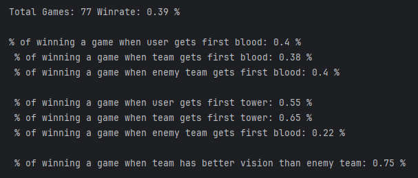

# Player Analysis Notebook for League of Legends
Jupyter Notebook for analyzing League of Legends data of an user.  
With this you can configure the settings of the Notebook to analyze a player data and see his stats and winrate

You can use it on [Google Collab - EN Version](https://colab.research.google.com/drive/147Eg-8uvO_w9Uxs5t3Bm8Xh5-e39cC0P)  
Tambien esta en español en [Google Collab - ES Version](https://colab.research.google.com/drive/19obBBam7tgXCC4jiLdf4X3XuLjiJ62rC)

# Information

- Winrate when user, team and enemy team gets first blood
- Winrate when user, team and enemy team gets first tower
- Winrate when team has better vision than enemy team
- Winrate by Champion, Role and Side
- Winrate vs Enemy Champions and Allies
- Minions per Minute by Champions
- Percentage of games where do you have high and low kda players
- KDA Mean by Champion

# Examples

