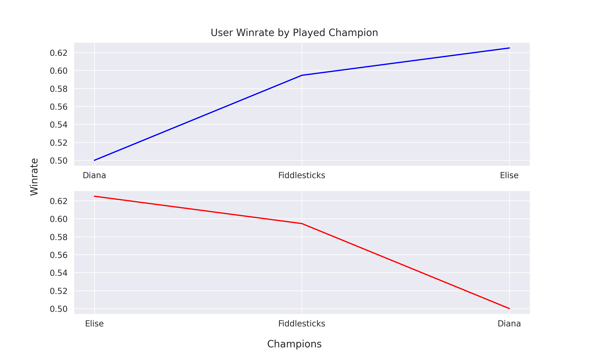
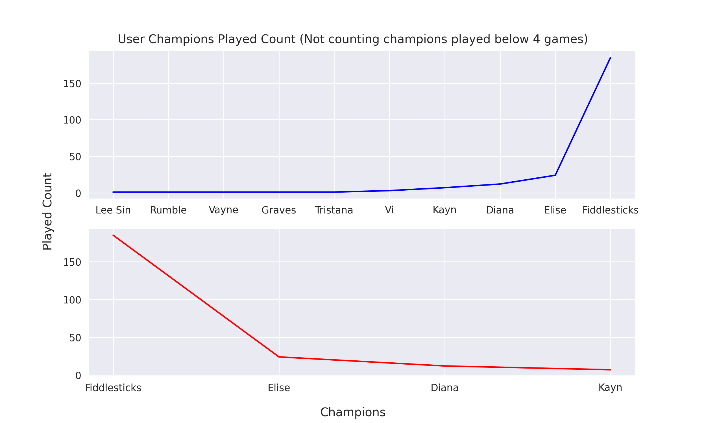
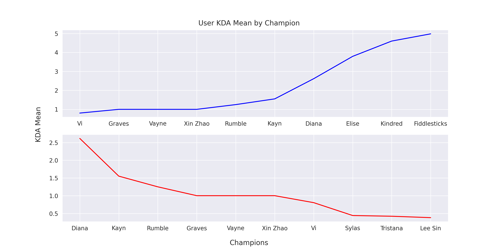

# Simple League of Legends Data Script
Simple python script for analyzing League of Legends data.

# Questions solving
- Most played champions by user and general
- Champions winrate by user and general
- Champions KDA Mean by user and general
- User role by best winrate

# Another data
- Percentage of female/male champions played
- Winrate by gender of the champions
- Friend's winrate

# Examples

